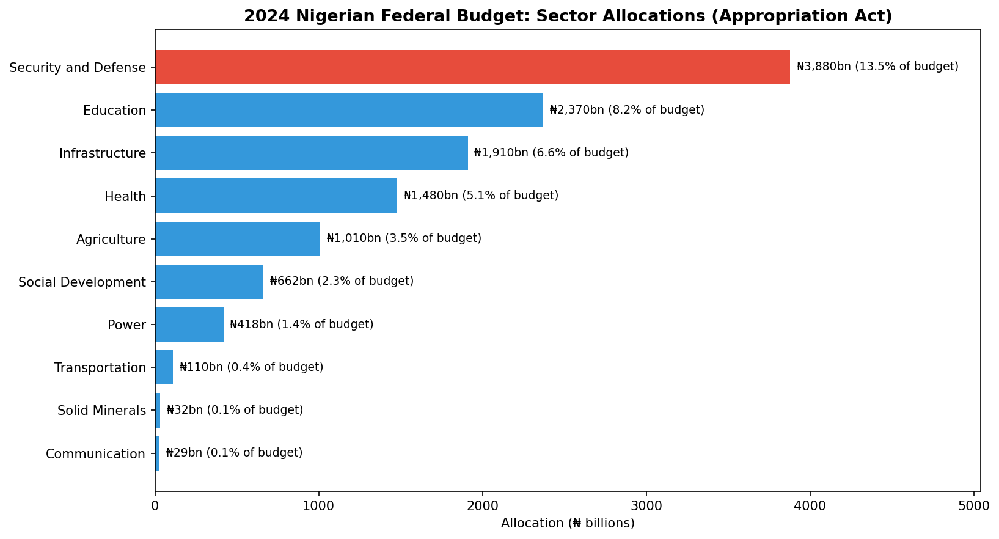

# 2024 Nigerian Federal Budget Analysis

**Author:** Abdullahi Isah

**Date:** October 2026

**Tools:** Python (pandas, Matplotlib)

---

## Overview

This project analyses how the 2024 Nigerian Federal Budget (Appropriation Act, signed 1 January 2024, ₦28.77 trillion) allocates money across ten sectors, and what the shares say about spending priorities.

## Data and Methods

**Source:** BudgIT 2024 budget analysis of the signed Appropriation Act. Amounts are in ₦ billions.

**Method:** Sector allocations were entered in Python, loaded into a pandas DataFrame, and converted to shares of the full budget (₦28,777 billion). Sectors were ranked and compared.

**Scope:** The ten sectors total ₦11,901 billion, or 41.4% of the budget. Other items, such as debt service, are not part of these sector figures.

## Key Findings

| Sector | Allocation (₦ billions) | % of full budget |
| :--- | ---: | ---: |
| Security and Defense | 3,880 | 13.48% |
| Education | 2,370 | 8.24% |
| Infrastructure | 1,910 | 6.64% |
| Health | 1,480 | 5.14% |
| Agriculture | 1,010 | 3.51% |
| Social Development | 662 | 2.30% |
| Power | 418 | 1.45% |
| Transportation | 110 | 0.38% |
| Solid Minerals | 32 | 0.11% |
| Communication | 29 | 0.10% |

- **Security leads:** Security and Defense has the largest allocation (13.48% of the budget), 5.24 percentage points above Education and about 64% more in naira.
- **Education and health:** Education receives 8.24% and Health 5.14%. Health's allocation is about 38% of Security's.
- **Smallest allocations:** Communication (0.10%) and Solid Minerals (0.11%) receive the least. This may partly reflect how spending is categorised across budget lines.

## Questions for Further Analysis

1. How do these shares compare with the 2023 budget?
2. How much of the allocated amounts was actually released and spent?
3. How do the shares compare with benchmarks such as the Abuja Declaration target for health?

## Limitations

These are planned allocations in the Act, not actual spending. Only ten sectors are covered, and sector categories follow the source's grouping.
